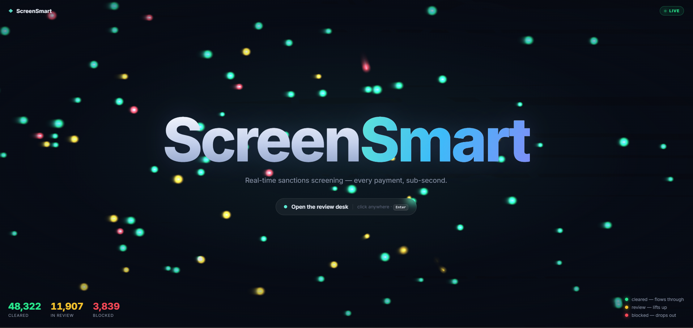
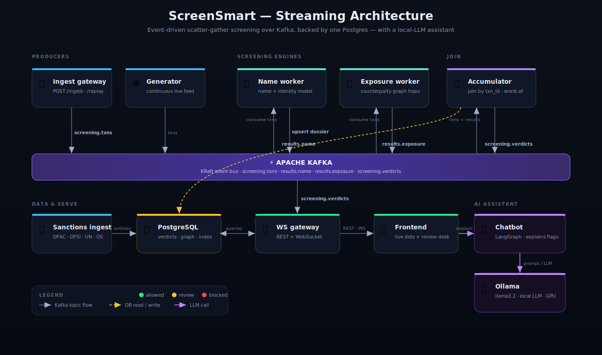

# ScreenSmart

**Real-time sanctions screening — every payment, sub-second.**

ScreenSmart is a streaming sanctions-screening platform. Each payment (a name + country
for fiat, or an account / wallet for crypto) is turned into a **MATCH / REVIEW / NO_MATCH**
verdict in well under a second, fanned out across two independent screening engines, joined
into a single dossier, and surfaced live on an analyst dashboard.



---

## What it does

- **Name & identity screening** — an IDF-weighted phonetic/token blocking index narrows
  ~70k sanctioned entities to a small candidate set, a 15-feature model scores each
  candidate to a calibrated probability, and risk-adjusted thresholds produce the verdict.
  Exact passport / national-ID and DOB rules short-circuit or promote/demote matches.
- **Network (graph) exposure** — traces an account through a counterparty graph to find
  hidden links to sanctioned/suspicious entities (e.g. *payee → intermediary → sanctioned
  source*), with a full evidence chain explaining how the path was found.
- **Live dashboard** — a particle field where every dot is a real screened payment
  (green = cleared, amber = review, red = blocked); click any dot or queue row for the full
  dossier, drill into any graph node to see who it belongs to, its counterparties, and its
  own exposure.
- **Analyst feedback loop** — Block / Escalate on a flagged payment marks the account as a
  risk node in the graph; the exposure engine automatically re-propagates so future
  payments routing through it are caught.
- **AI assistant** — a local LLM (Ollama · llama3.2, orchestrated with LangGraph) explains,
  in plain language, *why* a payment was flagged — streamed right into the review desk.
  Nothing leaves the machine.

---

## Architecture

An event-driven scatter-gather pipeline over Kafka, backed by one Postgres.



- **Fan out to both engines always**; each worker marks `applicable:false` when it has
  nothing to screen. The accumulator combines only the applicable parts (worst-of:
  MATCH > REVIEW > NO_MATCH).
- **Verdict → status → colour**: MATCH = blocked 🔴, REVIEW = review 🟡, NO_MATCH = allowed 🟢.
- Event contracts live in `streaming/pipeline/contracts.py`.

### Modules (top-level)

| Dir | What it is | Runs as |
|---|---|---|
| `screensmart_app/` | name/identity screening engine + REST API + Kafka worker | `screensmart-api`, `screensmart-worker` |
| `exposure_graph/` | counterparty graph-hop exposure engine + Kafka worker | `exposure-worker` |
| `sanctions_ingestion/` | downloads/parses OFAC/OFSI/UN/OpenSanctions → Postgres | `sanctions-ingest` |
| `streaming/pipeline/` | glue services: ingest gateway, generator, accumulator, ws-gateway | `ingest`, `generator`, `accumulator`, `ws-gateway` |
| `frontend/` | React + Vite dashboard (live feed + analyst review desk) | `frontend` (nginx) |
| `chatbot/` | local-LLM assistant (LangGraph + Ollama) that explains flags | `chatbot`, `ollama` |
| `data/`, `reports/`, `models/` | datasets, charts, trained model | mounted volumes |

> ⚠ `screensmart_app` and `exposure_graph` both use the package name `screensmart`, so they
> must never run in the same process — they only ever talk over Kafka topics.

---

## Quick start (Docker)

```bash
cp .env.example .env                 # Postgres creds, JWT secret, analyst login
docker compose up --build            # kafka, postgres, all services, frontend

# one-time data prep (separate shells):
docker compose run --rm sanctions-ingest si-init-db
docker compose run --rm sanctions-ingest si-ingest                     # fill sanctions DB
docker compose run --rm --no-deps exposure-worker python -m screensmart.db.init_db
docker compose run --rm --no-deps exposure-worker python -m screensmart.exposure.synthetic_graph
docker compose run --rm --no-deps exposure-worker python -m screensmart.exposure.precompute
```

The `generator` service then streams realistic payments continuously, so the dashboard
fills with live traffic on its own.

**Ports**: frontend `:8080` · ws-gateway `:8091` (REST + WS) · ingest `:8090` ·
screensmart-api `:8000` · chatbot `:8092` · ollama `:11434` · kafka host `:29092` · postgres `:5432`.
Analyst login is handled automatically by the dashboard (demo: `analyst` / `analyst`).

> **AI assistant**: the `ollama` service runs llama3.2 locally (GPU if available — see the
> `gpus: all` block); `ollama-init` pulls the model on first bring-up. Point the chatbot at
> a different host/model via `OLLAMA_BASE_URL` / `OLLAMA_MODEL` in `.env`.

> **Note:** the trained model (`screensmart_app/models/precision_model.joblib`) and the
> processed datasets are regenerable build artifacts (gitignored). Generate the model with
> `screensmart_app/src/train_model.py` before building the API/worker image, or see
> `screensmart_app/README.md`.

---

## Key endpoints (ws-gateway, `:8091`)

| Endpoint | Purpose |
|---|---|
| `GET /stats` | live counts `{allowed, review, blocked, flagged}` |
| `WS /ws/feed` | live stream of every verdict (the dashboard dots) |
| `GET /review?status=` | dossiers by status (review / allowed / blocked) |
| `GET /node/{key}` | a single graph node's full view (owner, counterparties, exposure) |
| `POST /review/{txn_id}/decision` | record clear / escalate / block; flag the account |

The chatbot (`:8092`) adds `POST /chat` — streams a plain-language explanation of a dossier
from the local LLM — and `GET /health` (model + Ollama reachability).

---

## Further docs

- `screensmart_app/README.md` — screening-engine quick start
- `screensmart_app/ARCHITECTURE.md` — full design + measured results
- `sanctions_ingestion/README.md` — the sanctions ingestion service
